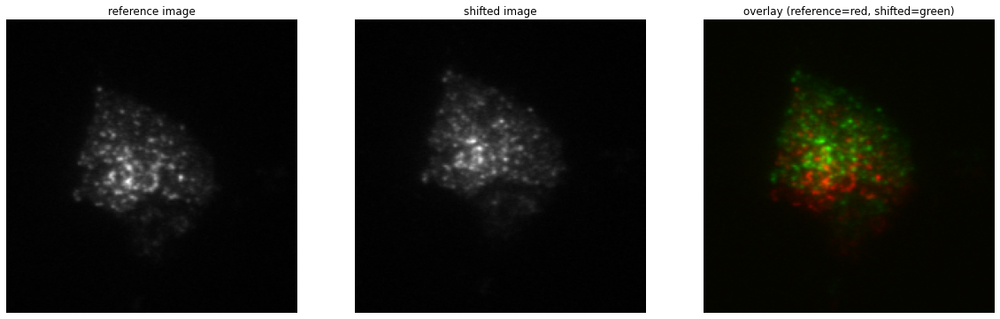
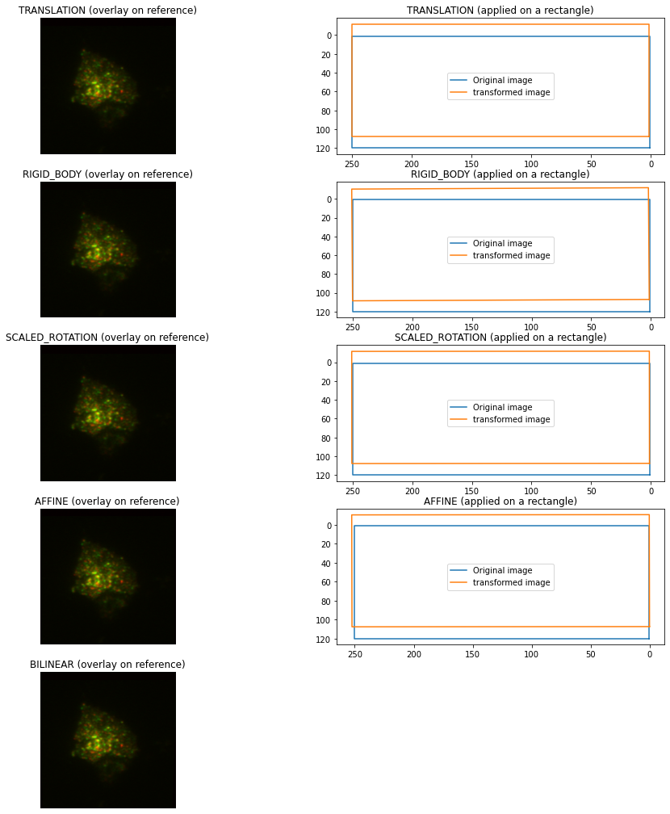
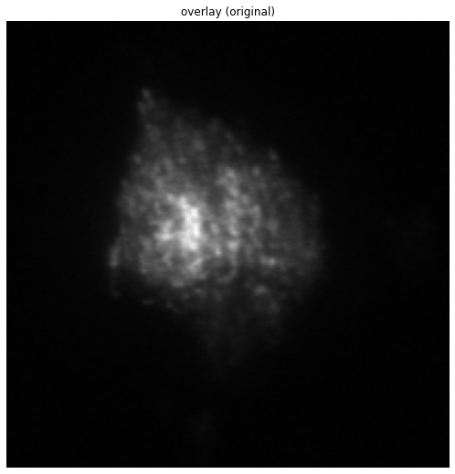
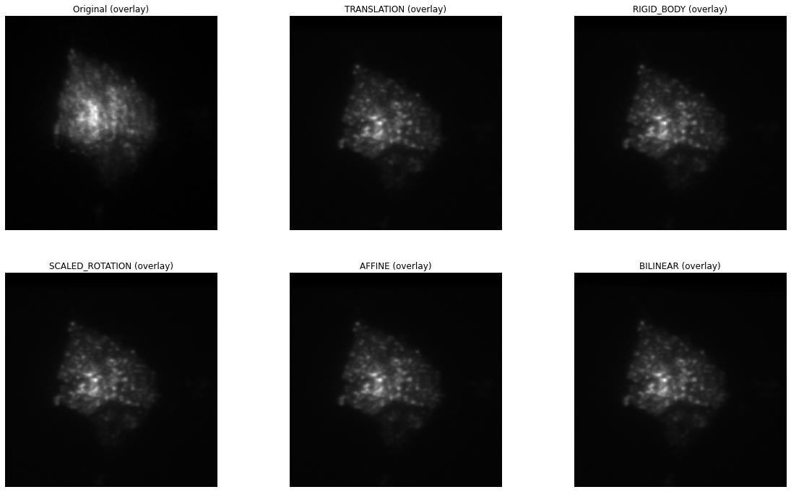
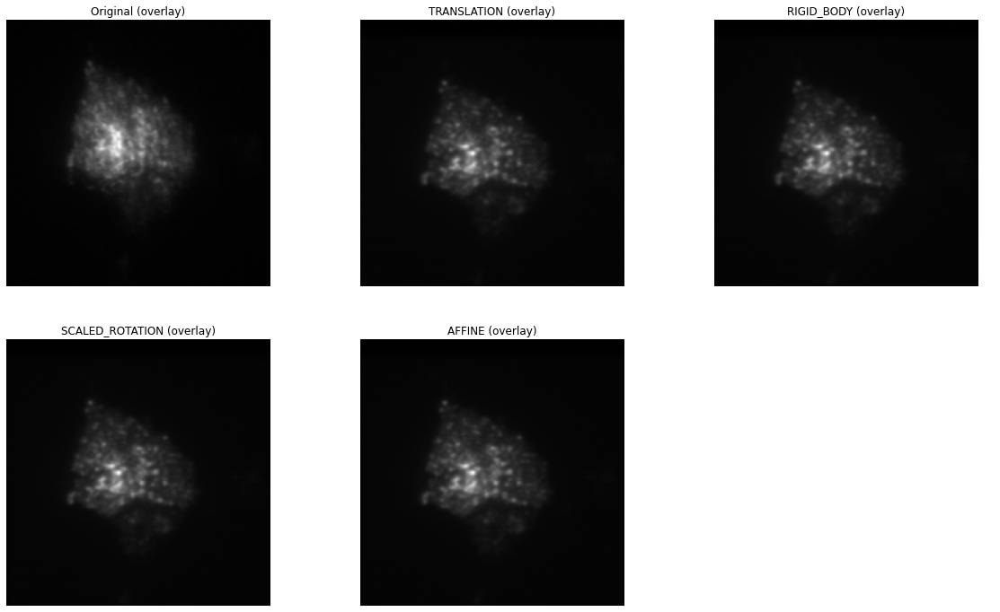

pystackreg tutorial
===================

This notebook demonstrates the uses of pystackreg on an example dataset
of a live neuronal structure.

Import pystackreg
-----------------

.. code:: ipython3

    import os
    import sys
    import numpy as np
    from matplotlib import pyplot as plt
    from skimage import transform, io, exposure
    
    from pystackreg import StackReg
    import pystackreg

.. code:: ipython3

    print(pystackreg.__version__)

.. parsed-literal::

    0.2.3rc1

Define helper functions
~~~~~~~~~~~~~~~~~~~~~~~

.. code:: ipython3

    def overlay_images(imgs, equalize=False, aggregator=np.mean):
        
        if equalize:
            imgs = [exposure.equalize_hist(img) for img in imgs]
        
        imgs = np.stack(imgs, axis=0)
        
        return aggregator(imgs, axis=0)

.. code:: ipython3

    def composite_images(imgs, equalize=False, aggregator=np.mean):
        
        if equalize:
            imgs = [exposure.equalize_hist(img) for img in imgs]
        
        imgs = [img / img.max() for img in imgs]
        
        if len(imgs) < 3:
            imgs += [np.zeros(shape=imgs[0].shape)] * (3-len(imgs))
      
        imgs = np.dstack(imgs)
        
        return imgs

Load sample data
~~~~~~~~~~~~~~~~

.. code:: ipython3

    data_path = os.path.join(os.getcwd(), '..', 'data')
    unreg = io.imread(os.path.join(data_path, 'pc12-unreg.tif'))
    
    # convert to float to prevent overflows when calculating differences images
    unreg = unreg.astype(np.float)

Perform single image registration
---------------------------------

.. code:: ipython3

    transformations = {
        'TRANSLATION': StackReg.TRANSLATION,
        'RIGID_BODY': StackReg.RIGID_BODY,
        'SCALED_ROTATION': StackReg.SCALED_ROTATION,
        'AFFINE': StackReg.AFFINE,
        'BILINEAR': StackReg.BILINEAR
    }

.. code:: ipython3

    #load reference and "moved" image
    ref = unreg[0, :, :]
    mov = unreg[4, :, :]

Show original images
~~~~~~~~~~~~~~~~~~~~

.. code:: ipython3

    f, ax = plt.subplots(1, 3, figsize=(20, 9))
    
    before_reg = composite_images([ref, mov])
    
    ax[0].imshow(ref, cmap='gray')
    ax[0].set_title('reference image')
    ax[0].axis('off')
    
    ax[1].imshow(mov, cmap='gray')
    ax[1].set_title('shifted image')
    ax[1].axis('off')
    
    ax[2].imshow(before_reg)
    ax[2].set_title('overlay (reference=red, shifted=green)')
    ax[2].axis('off');

As can be seen from the overlay image (right), the second image (middle)
is shifted considerably with respect to the reference image (left).

Transform shifted image
~~~~~~~~~~~~~~~~~~~~~~~

We will next use all available transformation modes from pystackreg to
register the shifted image to the reference image.

.. code:: ipython3

    def show_transformation(tmat, ax=None):
        if ax is None:
            _, ax = plt.subplots()
        p = np.array([[1,120,1], [1,1,1], [250, 1, 1], [250,120,1], [1,120,1]])
        ax.plot(p[:, 0], p[:,1])
        q=np.dot(p, tmat.T)
        ax.plot(q[:, 0], q[:,1])
        ax.invert_xaxis()
        ax.invert_yaxis()
        ax.legend(['Original image', 'transformed image'])

.. code:: ipython3

    f, ax = plt.subplots(5, 2, figsize=(16, 18))
    
    for i, (name, tf) in enumerate(transformations.items()):
        sr = StackReg(tf)
        reg = sr.register_transform(ref, mov)
        reg = reg.clip(min=0)
            
        after_reg =  composite_images([ref, reg])
        
        ax[i][0].imshow(after_reg, cmap='gray', vmin=0, vmax=1)
        ax[i][0].set_title(name + ' (overlay on reference)')
        ax[i][0].axis('off')
        
        if name != 'BILINEAR':
            show_transformation(sr.get_matrix(), ax[i][1])
            ax[i][1].set_title(name + ' (applied on a rectangle)')
        else:
            ax[i][1].axis('off')

Translation already performs a quite good job at registering the images.

In the right column, the action of the transformation matrix on a
rectangle is shown.

Perform stack transformations
-----------------------------

.. code:: ipython3

    print(f"Number of images in the stack: {len(unreg)}")

.. parsed-literal::

    Number of images in the stack: 5

The original stack contains 5 images, we have so far only looked at the
registration of two images out of that stack. We will next see how to
use pystackreg to register the whole stack of 5 images.

Show original images (overlay)
~~~~~~~~~~~~~~~~~~~~~~~~~~~~~~

.. code:: ipython3

    f, ax = plt.subplots(1, 1, figsize=(10, 9))
    
    ax.imshow(overlay_images(unreg), cmap='gray')
    ax.set_title('overlay (original)')
    ax.axis('off');

The above image is the mean of each of the 5 images of the stack. As can
bee seen, it is quite blurry due to the misalignment.

Register and transform the whole stack
~~~~~~~~~~~~~~~~~~~~~~~~~~~~~~~~~~~~~~

We will next use all 5 kinds of transformation offered by pystackreg to
register the stack’s images. Afterwards the average of the registered
images is shown for each of the different types of transformations.

**Note** that we will save the transformation matrices of each
transformation in a list ``tmats`` for later use.

.. code:: ipython3

    f, ax = plt.subplots(2, int(np.ceil((len(transformations)+1)/2)), figsize=(20, 12))
    ax = ax.ravel()
    
    ax[0].imshow(overlay_images(unreg, aggregator=np.mean), cmap='gray')
    ax[0].set_title('Original (overlay)')
    ax[0].axis('off')
    
    # store transformation matrices for later use in this variable
    tmats = []
    
    for i, (name, tf) in enumerate(transformations.items()):
        sr = StackReg(tf)
        
        reference = 'first' if name == 'BILINEAR' else 'previous'
        
        tmat = sr.register_stack(unreg, axis=0, reference=reference, verbose=True)
        reg = sr.transform_stack(unreg)
        
        tmats.append(tmat)
        
        ax[i+1].imshow(overlay_images(reg, aggregator=np.mean), cmap='gray')
        ax[i+1].set_title(name + ' (overlay)')
        ax[i+1].axis('off')

.. parsed-literal::

    100%|██████████| 4/4 [00:00<00:00, 59.11it/s]
    100%|██████████| 4/4 [00:00<00:00, 32.64it/s]
    100%|██████████| 4/4 [00:00<00:00, 30.12it/s]
    100%|██████████| 4/4 [00:00<00:00, 26.77it/s]
    100%|██████████| 4/4 [00:00<00:00, 18.93it/s]

As can bee seen, all types of transformation lead to a much clearer
average image of the stack, equivalent to nicely registered images.

Use saved transformation matrices
---------------------------------

Note that in the above operation we have saved the transformation
matrices generated from pystackreg in the variable ``tmats``. We will
now use the affine transformation implemented in skimage to perform what
pystackreg does in its ``transform`` functions using a different
package. This will demonstrate that the transformation matrices supplied
by pystackreg can be stored and used in any desired context even without
having to use pystackreg.

.. code:: ipython3

    f, ax = plt.subplots(2, int(np.ceil((len(transformations)+1)/2)), figsize=(20, 12))
    ax = ax.ravel()
    
    ax[0].imshow(overlay_images(unreg, aggregator=np.mean), cmap='gray')
    ax[0].set_title('Original (overlay)')
    ax[0].axis('off')
    
    for i, (name, tf) in enumerate(transformations.items()):
        
        if name == 'BILINEAR':
            # Bilinear transformation is not an affine transformation, we can't use the transformation matrix here
            continue
        
        # copy the unregistered image
        reg = unreg.copy()
        
        for i_img in range(unreg.shape[0]):
            # get skimage's AffineTransform object
            tform = transform.AffineTransform(matrix=tmats[i][i_img, :, :])
            
            # transform image using the saved transformation matrix
            reg[i_img, :, :] = transform.warp(reg[i_img, :, :], tform)
        
        
        ax[i+1].imshow(overlay_images(reg, aggregator=np.mean), cmap='gray')
        ax[i+1].set_title(name + ' (overlay)')
        ax[i+1].axis('off')
    
    # turn off axis in remaining plots
    for i in range(len(transformations), len(ax)):
        ax[i].axis('off')

Custom callback for registration progress
-----------------------------------------

The ``register()`` and ``register_stack()`` function can be called with
a custom callback function that can be used to display progress
information to the user.

The custom callback needs to accept the two parameters
``current_iteration`` and ``end_iteration``:

.. code:: ipython3

    def show_progress(current_iteration, end_iteration):
        print(f"Registering {current_iteration} of {end_iteration} images")
    
    
    sr = StackReg(StackReg.RIGID_BODY)
    reg = sr.register_transform_stack(unreg, axis=0, progress_callback=show_progress)

.. parsed-literal::

    Registering 1 of 4 images
    Registering 2 of 4 images
    Registering 3 of 4 images
    Registering 4 of 4 images

Clipping of negative values
---------------------------

The transformation output of pystackreg is exactly equivalent to that of
the ImageJ plugins TurboReg/StackReg on which it is based. The output of
the transform function therefore has a ``float`` datatype and may
contain negative values. To again create an image with integer values,
the utility function ``pystackreg.util.to_uint16()`` can be used.

.. code:: ipython3

    from pystackreg.util import to_uint16

.. code:: ipython3

    sr = StackReg(StackReg.RIGID_BODY)
    reg = sr.register_transform_stack(unreg - unreg.min())
    
    print(f"The output of the transform function has the datatype {reg.dtype} with a minimal value of {reg.min()}")

.. parsed-literal::

    The output of the transform function has the datatype float64 with a minimal value of -29.488252639770508

.. code:: ipython3

    reg_int = to_uint16(reg)
    
    print(f"After using the to_uint16 function, the output has a datatype {reg_int.dtype} with a minimal value of {reg_int.min()}")

.. parsed-literal::

    After using the to_uint16 function, the output has a datatype uint16 with a minimal value of 0

Registration of stacks having the frames/(“time”) not as the first axis
-----------------------------------------------------------------------

pystackreg expects the frames (“time”) axis in a stacked image as the
first axis, i.e. for a 3D numpy array, pystackreg expects the dimensions
to be ``frames x width x height``. pystackreg automatically tries to
find out which axis is the frames axis and raises a warning if that axis
is not the axis that the user supplied.

Create test data
~~~~~~~~~~~~~~~~

We will first create a stack that has the frames axis at axis 2 (instead
of the default axis 0) by moving the axis from our sample data:

.. code:: ipython3

    unreg.shape

.. parsed-literal::

    (5, 201, 199)

.. code:: ipython3

    unreg_axis = np.moveaxis(unreg, 0, 2)
    unreg_axis.shape

.. parsed-literal::

    (201, 199, 5)

Register & transform
~~~~~~~~~~~~~~~~~~~~

Next we register the stack using pystackreg’s default parameters

.. code:: ipython3

    sr = StackReg(StackReg.RIGID_BODY)
    sr.register_stack(unreg_axis);

.. parsed-literal::

    /home/lichtneg/anaconda3/envs/py36/lib/python3.6/site-packages/pystackreg-0.2.3rc1-py3.6-linux-x86_64.egg/pystackreg/pystackreg.py:383: UserWarning: Detected axis 2 as the possible time axis for the stack due to its low variability, but axis 0 was supplied for registration. Are you sure you supplied the correct axis?
      lowest_var_axis, axis

Notice that this raises a warning as pystackreg correctly identified
axis 2 as the frames axis. So let’s use that axis for registration:

.. code:: ipython3

    sr.register_stack(unreg_axis, axis=2);

Next transform the stack. Note that we need to supply the axis parameter
again here - otherwise an error will be raised.

.. code:: ipython3

    reg_axis = sr.transform_stack(unreg_axis, axis=2)
